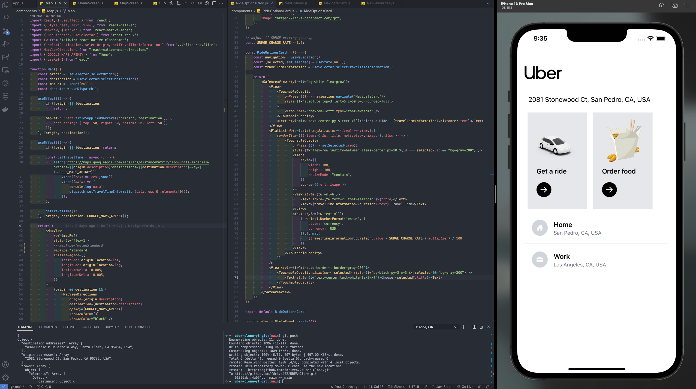
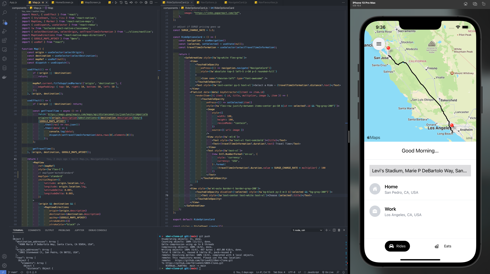
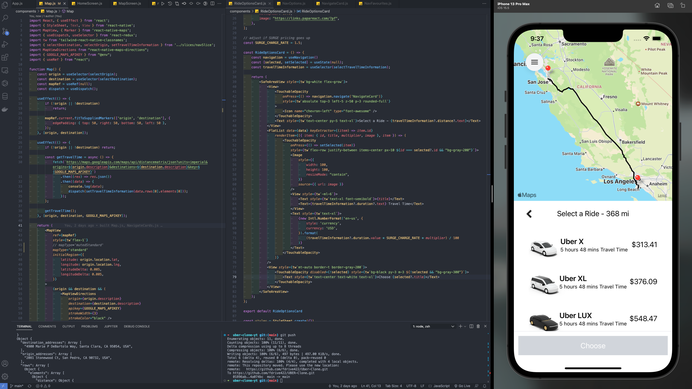

## Uber2.0 iOS Mobile App Clone

### Built with JavaScript React Native, Redux, Expo

### APIs employed: Google Places, Driections, Distacne Matrix

#### Home Screen

#### Map Screen

#### Ride Options

#### \*Credit: Sonny Sangha -aka- PapaReact for his React Native build tutorial
